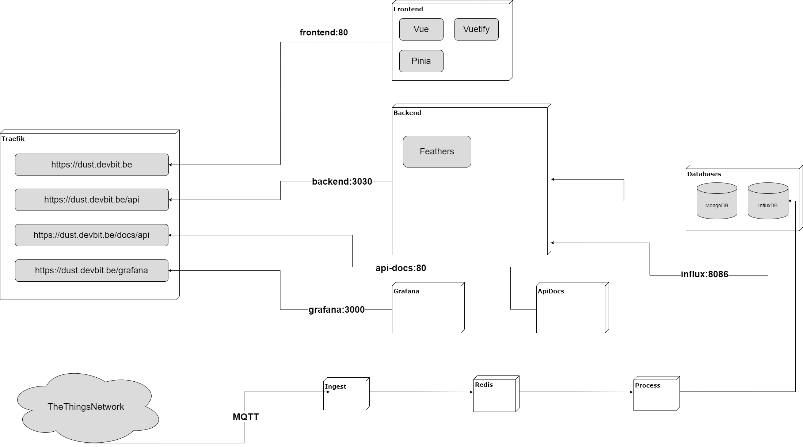

# DUST Framework

## Services

* [Backend API (FeathersJS)](https://dust.devbitapp.be/api)
* [Grafana](https://dust.devbitapp.be/grafana)
* [API Docs](https://dust.devbitapp.be/docs/api)
* [FrontEnd](https://dust.devbitapp.be)



## Development

1. Setup the env files
2. Fire up the containers

```bash
docker-compose -f docker-compose.dev.yml up --build
```

3. Configure InfluxDB

Navigate to [http://localhost:8086/](http://localhost:8086/). Pick a username and password which you later need to place inside the `.env` file. Fill in the rest of the information as stated below:

* `Initial Organization Name`: `dust`
* `Initial Bucket Name`: `dust`

Next navigate to `Data => API Tokens` and copy the API token for dust to the `.env` file.

Restart the docker containers.

### Services

* [InfluxDB](http://localhost:8086/)
* [MongoExpress](http://localhost:8081/)
* [FeathersJS](http://localhost:3030/)
* [Grafana](http://localhost:3000/)
* [API Docs](http://localhost/)

## Info Resources

### Flux Overview

[https://www.sqlpac.com/en/documents/influxdb-moving-from-influxql-language-to-flux-language.html](https://www.sqlpac.com/en/documents/influxdb-moving-from-influxql-language-to-flux-language.html).
